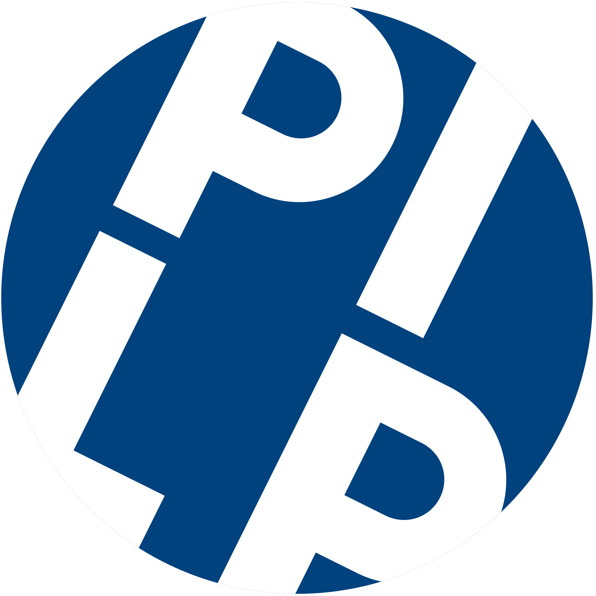

# Curie-CLI

## Attribution

### PLIP ( Protein-Ligand Interaction Profiler )

PLIP is used for generating visualisations and for profiling interactions. PLIP is powered by 

> Salentin,S. et al. PLIP: fully automated protein-ligand interaction profiler. Nucl. Acids Res. (1 July 2015) 43 (W1): W443-W447. doi: 10.1093/nar/gkv315

### PyMOL

PyMOL is used to render visualisations

PyMOL Copyright (c) Schrodinger, LLC

PyMOL is Published under a BSD-like license, see LICENSE.

### AutoDock Vina

AutoDock Vina is used for performing molecular docking

> 	O. Trott, A. J. Olson, AutoDock Vina: improving the speed and accuracy of docking with a new scoring function, efficient optimization and multithreading, Journal of Computational Chemistry 31 (2010) 455-461
